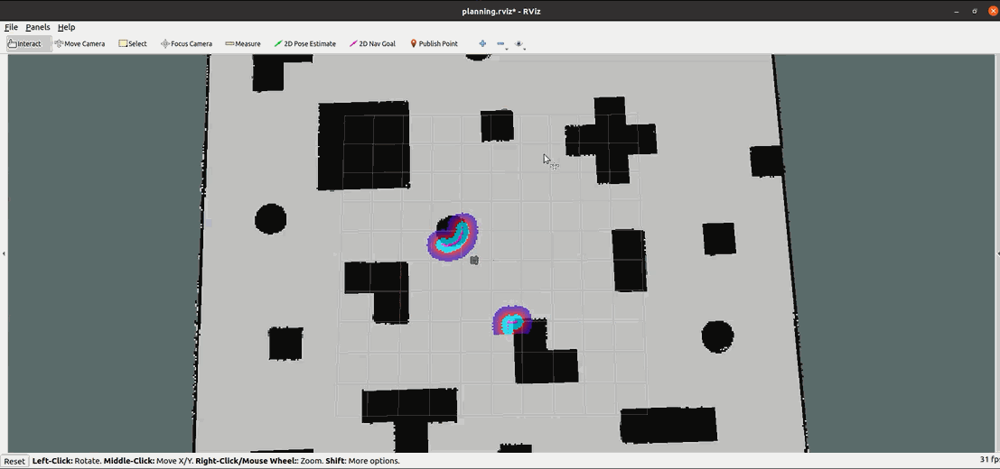

# psolqr_local_planner


<p align="center">
    
    
</p>

## 1. Introduction

Lightweight ROS Local Path Planner Plugin with PSO and LQR:

This ROS plugin offers a lightweight solution for local path planning. It employs the Particle Swarm Optimization (PSO) algorithm for precise local path planning and leverages the Linear Quadratic Regulator (LQR) algorithm to achieve accurate trajectory tracking control."

"In the design of our PSOLQR local path planner, we adopted a decoupled architecture for planning and control. The core processes of the planning and control algorithms are implemented separately in pso_optimizer.cpp and lqr_controller.cpp, respectively. These components offer reserved interfaces for quick and easy access to planning and control functions. This modular approach allows for convenient changes to planning or control algorithms without needing to redesign the local planner, offering excellent scalability."

An illustration of the system's performance is shown below：


### (1) Diagram 1:

<div align="center">
  
</div>

### (2) Diagram 2:

<div align="center">
  
</div>


The development of this open-source repository has been relatively short. We've completed the design and implementation of the entire framework, ensuring it functions properly. However, due to time constraints, many intermediate processes and details have not been thoroughly validated to determine whether they meet the intended design expectations and effectiveness. Experimentally, the results have not reached the desired goals, indicating a need for further optimization and adjustments. Unfortunately, for a significant period thereafter, I'll be occupied with other important matters, forcing the optimization of this project to be temporarily suspended. We eagerly welcome interested contributors to optimize and enhance it. Of course, in the future, I may revisit it for optimization.


## 2. How to Use


You can employ this plugin within the ROS navigation package by configuring the local path planner plugin to `psolqr_planner/PsoLqrPlanner` in the launch file where the 'move_base' node is situated. Additionally, load the parameter configuration file `psolqr_planner_params.yaml`. An example is provided below:

```bash
<node pkg="move_base" type="move_base" respawn="false" name="move_base" output="screen">

    <!-- Load other parameter configuration files -->
    ...
    ...
    ...

    <!-- Load PSOLQR Local Planner Parameters -->
    <rosparam file="$(find psolqr_local_planner)/config/psolqr_planner_params.yaml" command="load" />

    <!-- Set Local Path Planner Plugin -->
    <param name="base_global_planner" value="psolqr_planner/PsoLqrPlanner" />

    <!-- Set other parameters such as global path planner plugin -->
    ...
    ...
    ...

</node>
```


